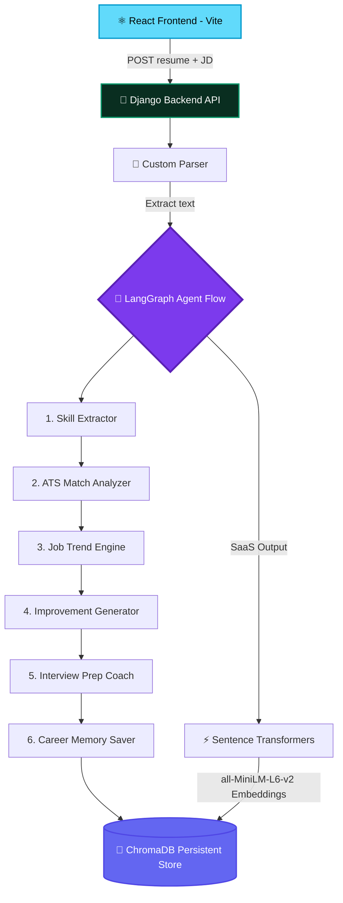

<div align="center">

<!-- Animated Banner -->


<!-- Badges -->
<p align="center">
  
  
  
  
  
</p>

<p align="center">
  <a href="https://ningaraju.vercel.app">
    
  </a>
</p>

</div>

---

## 🌟 **What is SkillUp AI?**

<div align="center">

```ascii
╔═══════════════════════════════════════════════════════════════╗
║                                                               ║
║   🧠 LANGGRAPH MULTI-AGENT RESUME ANALYZER                    ║
║                                                               ║
║   ⚡ PARSE       → Advanced Text Extraction (.pdf, .docx, .doc) ║
║   🎯 ATS MATCH   → Realistic Score Alignment & Recommendations  ║
║   🤖 INTERVIEW   → Tailored Questions & Answers Preparation     ║
║   💾 LONG MEMORY → ChromaDB Persistent Vector Database Storage   ║
║                                                               ║
╚═══════════════════════════════════════════════════════════════╝
```

</div>

> A **next-generation AI-powered Career Copilot** that leverages a multi-agent LangGraph workflow to scan resumes against target job descriptions, evaluate semantic match score, find missing skills, generate CV improvements, create customized mock interview guides, and map out career trajectories.

---

## ✨ **Key Highlights**

<table>
<tr>
<td width="50%">

### 🎨 **Stunning Glassmorphism UI**
- 🌌 **Ambient Glows** - Futuristic indigo and purple backdrop lights
- 🌈 **Vibrant Indicators** - High-contrast visual match gauges
- ✨ **Custom Typography** - Styled with modern Outfit typography
- 📥 **Interactive Dropzone** - Seamless file drag & drop

</td>
<td width="50%">

### ⚙️ **AI & Agentic Pipeline**
- 🤖 **LangGraph Workflows** - Multi-agent node orchestrations
- 🧠 **ChromaDB Vector Store** - Long-term career memory storage
- 🔍 **Cosine Similarity** - Embedded job description fit matching
- 📄 **Custom File Parsers** - Handles pdf, docx, and legacy doc files

</td>
</tr>
</table>

---

## 🏗️ **System Architecture**

<div align="center">



</div>

---

## 🎯 **Agentic & Analysis Pipeline Tools**

| Stage | Node / Tool | Description | Model/Engine |
|:---|:---:|:---|:---|
| **Parsing** | `pdf_parser` | Safely extracts text from pdf, docx, doc | `pypdf`, `python-docx`, raw binary streams |
| **Extraction** | `skill_extractor` | Extracts technical skills from CV | Groq `llama-3.3-70b-versatile` |
| **Analysis** | `ats_analyzer` | Matches CV keywords against Job Requirements | Groq `llama-3.3-70b-versatile` |
| **Scoring** | `cosine_similarity` | Computes mathematical distance embeddings | `all-MiniLM-L6-v2` |
| **Optimization** | `improvement_generator` | Generates CV structure & content improvements | Groq `llama-3.3-70b-versatile` |
| **Preparation** | `interview_generator` | Tailors custom interview prep guides | Groq `llama-3.3-70b-versatile` |
| **Memory** | `career_memory` | Indexes data to vector database for tracking | `ChromaDB` Persistent Store |

---

## 🚀 **Quick Start**

<details open>
<summary><b>📋 Prerequisites</b></summary>
<br>

```bash
✅ Python 3.10+
✅ Node.js 18+ (for frontend)
✅ Groq API Key (Free)
```

</details>

<details open>
<summary><b>🔑 API Setup</b></summary>
<br>

1. Get a free Groq API key from **[Groq Console](https://console.groq.com)**.
2. In the `Skillup AI` directory, create a `.env` file based on `.env.example`:

```env
GROQ_API_KEY=gsk_your_actual_api_key_here
```

</details>

<details open>
<summary><b>🎯 Run Django Backend</b></summary>
<br>

```bash
pip install -r requirements.txt
python manage.py migrate
python manage.py runserver
```

**🌐 API Server starts at:** `http://localhost:8000`

</details>

<details open>
<summary><b>⚛️ Run React Frontend</b></summary>
<br>

```bash
cd frontend
npm install
npm run dev
```

**🌐 App launches at:** `http://localhost:5173`

</details>

---

## 👨💻 **About the Developer**

<div align="center">

### **Ningaraju K**

[](https://ningaraju.vercel.app)
[](https://github.com/Ningaraju1)

</div>

---
