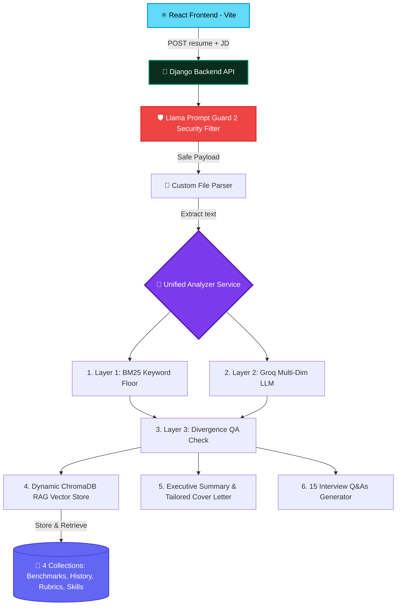

<div align="center">

<!-- Animated Banner -->


<!-- Badges -->
<p align="center">
  
  
  
  
  
  
</p>

<p align="center">
  <a href="https://ningaraju.vercel.app">
    
  </a>
</p>

</div>

---

## 🌟 **What is SkillUp AI?**

<div align="center">

```ascii
╔══════════════════════════════════════════════════════════════════╗
║                                                                  ║
║ 🧠 LANGGRAPH MULTI-AGENT RESUME ANALYZER                         ║
║                                                                  ║
║ ⚡ PARSE       → Advanced Text Extraction (.pdf, .docx, .doc)    ║
║ 🎯 HYBRID MATCH → BM25 Keyword Floor + Groq Multi-Dim LLM        ║
║ 🛡️ SECURITY    → Llama Prompt Guard 2 Injection Filter (~10ms)   ║
║ 🤖 INTERVIEW   → 15 Technical & Behavioral Q&As + Cover Letter   ║
║ 💾 RAG MEMORY  → ChromaDB 4-Collection Persistent Memory Store   ║
║                                                                  ║
╚══════════════════════════════════════════════════════════════════╝
```

</div>

> A **next-generation AI-powered Career Copilot** leveraging a layered hybrid architecture (Deterministic BM25 Keyword Floor + Groq Multi-Dimensional LLM) and ChromaDB RAG vector store. It scans resumes against target job descriptions, enforces hard-skill ground truths, flags score divergence QA risks, generates tailored cover letters & 15 interview guides, and tracks candidate evolution deltas.

---

## ✨ **Key Highlights**

<table>
<tr>
<td width="50%">

### 🎨 **Stunning Glassmorphism UI**
- 🌌 **Ambient Glows** - Futuristic indigo and purple backdrop lights
- 🌈 **Vibrant Indicators** - High-contrast visual match gauges & BM25 badges
- ✨ **Custom Typography** - Styled with modern Outfit typography
- 📊 **Executive Summary** - Strategic evaluation & score evolution deltas
- 📥 **Interactive Dropzone** - Seamless file drag & drop

</td>
<td width="50%">

### ⚙️ **AI & Agentic Pipeline**
- 🤖 **Layered Hybrid AI** - BM25 Floor + Groq LLM Multi-Dimensional
- 🛡️ **AI Security Pre-Flight** - Llama Prompt Guard 2 injection defense
- 🧠 **ChromaDB RAG Memory** - 4 collections tracking candidate evolution
- ⚖️ **Score Divergence QA** - Automated check flagging >35% LLM/BM25 deltas
- 📄 **Custom File Parsers** - Handles pdf, docx, and legacy doc files

</td>
</tr>
</table>

---

## 🏗️ **System Architecture**

<div align="center">


```mermaid
graph TD
    A[⚛️ React Frontend - Vite] -->|POST resume + JD| B[🐍 Django Backend API]
    B --> C[🛡️ Llama Prompt Guard 2 Security Filter]
    C -->|Safe Payload| D[📄 Custom File Parser]
    D -->|Extract text| E{🤖 Unified Analyzer Service}
    E --> F[1. Layer 1: BM25 Keyword Floor]
    E --> G[2. Layer 2: Groq Multi-Dim LLM]
    F & G --> H[3. Layer 3: Divergence QA Check]
    H --> I[4. Dynamic ChromaDB RAG Vector Store]
    I -->|Store & Retrieve| J[(💾 4 Collections: Benchmarks, History, Rubrics, Skills)]
    H --> K[5. Executive Summary & Tailored Cover Letter]
    H --> L[6. 15 Interview Q&As Generator]
    style A fill:#61DAFB,stroke:#0099cc,stroke-width:2px,color:#000
    style B fill:#092E20,stroke:#059669,stroke-width:2px,color:#fff
    style C fill:#ef4444,stroke:#dc2626,stroke-width:2px,color:#fff
    style E fill:#7c3aed,stroke:#5b21b6,stroke-width:3px,color:#fff
    style J fill:#6366f1,stroke:#4f46e5,stroke-width:2px,color:#fff
```

</div>

---

## 🎯 **Agentic & Analysis Pipeline Tools**

| Stage | Node / Tool | Description | Model/Engine |
|:---|:---:|:---|:---|
| **Security** | `prompt_guard` | Pre-flight prompt injection defense (~10ms) | `meta-llama/llama-prompt-guard-2-86m` |
| **Parsing** | `pdf_parser` | Safely extracts text from pdf, docx, doc | `pypdf`, `python-docx`, raw binary streams |
| **Keyword Floor** | `bm25_floor` | Objective term-frequency hard-skill matching | Deterministic BM25 Frequency Engine |
| **Analysis** | `multi_dim_analyzer` | Multi-dimensional resume vs JD fit analysis | Groq `openai/gpt-oss-120b` |
| **QA Check** | `divergence_check` | Detects >35% LLM vs BM25 score divergence | Automated Divergence Guardrail |
| **RAG Store** | `rag_engine` | Embeds & persists candidate scan history | ChromaDB 4-Collection Vector Store |
| **Executive** | `executive_summary` | Generates strategic candidate summary & deltas | Groq `openai/gpt-oss-120b` |
| **Preparation** | `interview_generator` | Generates 15 tailored technical & behavioral Q&As | Groq `openai/gpt-oss-120b` |
| **Cover Letter** | `cover_letter` | Auto-generates tailored professional cover letter | Groq `openai/gpt-oss-120b` |

---

## 🚀 **Quick Start**

<details open>
<summary><b>📋 Prerequisites</b></summary>
<br>

```bash
✅ Python 3.10+
✅ Node.js 20+ / VITE React.js (for frontend)
✅ Groq API Key (Free)
```

</details>

<details open>
<summary><b>🔑 API Setup</b></summary>
<br>

1. Get a free Groq API key from **[Groq Console](https://console.groq.com)**.
2. In the `Skillup AI` directory, create a `.env` file based on `.env.example`:

```env
GROQ_API_KEY=gsk_your_actual_api_key_here
```

</details>

<details open>
<summary><b>🎯 Run Django Backend</b></summary>
<br>

```bash
pip install -r requirements.txt
python manage.py migrate
python manage.py runserver
```

**🌐 API Server starts at:** `http://localhost:8000`

</details>

<details open>
<summary><b>⚛️ Run React Frontend</b></summary>
<br>

```bash
cd frontend
npm install
npm run dev
```

**🌐 App launches at:** `http://localhost:5173`

</details>

---

## 👨💻 **About the Developer**

<div align="center">

### **Ningaraju K**

[](https://ningaraju.vercel.app)
[](https://github.com/Ningaraju1)

</div>

---
